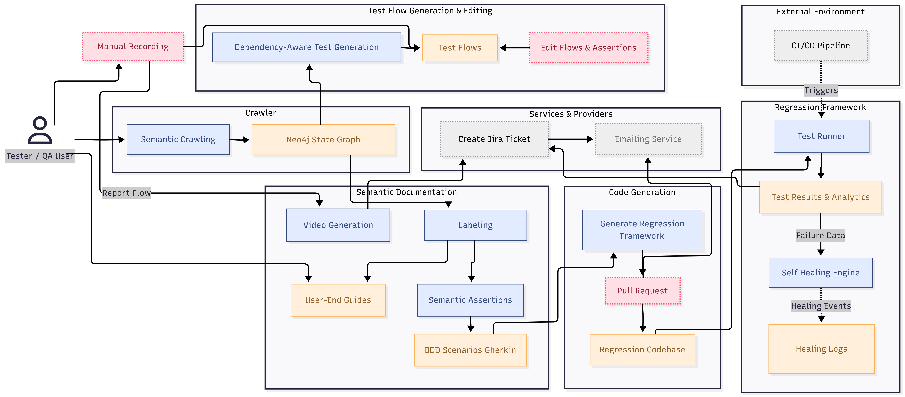

# CoverIt

CoverIt is a QA automation platform for web applications. It was built as a
graduation project at the Faculty of Engineering, Cairo University.

The project started from a practical problem: manual web testing is slow, and
many automated tools still depend heavily on raw DOM structure. That makes them
fragile when the UI changes and limited when the goal is to understand actual user
flows. CoverIt approaches the problem by crawling the application semantically,
storing the discovered behavior as a state graph, and using that graph to produce
test flows, regression code, user guides, and demo videos.

## What CoverIt does

CoverIt helps a QA engineer move from application exploration to regression
coverage with less manual work:

1. Create a project and register the target web application.
2. Run an automatic crawl or record a manual journey.
3. Store discovered states, transitions, and actions as an application graph.
4. Generate test flows that cover the discovered behavior.
5. Review flows, edit steps, and add assertions.
6. Generate executable regression code and open a pull request.
7. Monitor regression runs, failures, reports, and generated documentation.

The system is built around one idea: a single crawl should be useful in more than
one way. The same captured behavior supports regression tests, BDD scenarios,
user guides, issue reports, and walkthrough videos.

## Main modules

| Repository | Role |
| --- | --- |
| `coverit-frontend` | React and TypeScript web application used by QA engineers. |
| `coverit-api` | TypeScript API for projects, crawl sessions, flows, integrations, dashboards, and regression results. |
| `coverit-contracts` | Shared Protocol Buffer contracts published for TypeScript and Python services. |
| `coverit-crawler` | Python worker that drives Playwright, explores applications, records manual sessions, and builds the state graph. |
| `coverit-docgen` | Python worker that labels states and transitions, generates user-facing documentation, and renders walkthrough videos. |
| `coverit-regression` | TypeScript generator and worker that turns flows into executable regression code. |
| `.github` | Public profile docs, shared Git hooks, and reusable GitHub Actions workflows. |

See the [module guide](../docs/modules.md) for a closer look at each repository.

## Architecture at a glance

CoverIt is split into a web application, an API, background workers, shared
contracts, and generated test code.

See [architecture.md](../docs/architecture.md) for the full data flow.

## Demo video

The current public demo shows the CoverIt platform in action, including the main
product screens and the workflow around crawl sessions, generated flows, and
regression support.

## Tech stack

| Area | Tools |
| --- | --- |
| Frontend | React, TypeScript, Vite, React Query, Zustand, SCSS modules |
| API | Node.js, Express, TypeScript, Prisma, PostgreSQL |
| Workers | Python, ARQ, Redis, Playwright |
| Graph data | Neo4j |
| Regression | TypeScript, Playwright, generated BDD-style test code |
| Contracts | Protocol Buffers, npm package, Python wheel |
| Infrastructure | Docker Compose, GitHub Actions, shared Git hooks |

## Documentation

- [Architecture](../docs/architecture.md)
- [Modules](../docs/modules.md)
- [Workflow](../docs/workflow.md)
- [Local setup](../docs/local-setup.md)
- [Demo media](../docs/media.md)

## Project context

CoverIt was developed as a two-semester graduation project connecting several
parts of the QA process: semantic crawling, dependency-aware flow generation,
regression execution, self-healing support, manual recording, documentation
generation, and project analytics.

The result is a working platform that treats application behavior, not DOM
structure, as the source of truth for testing.
